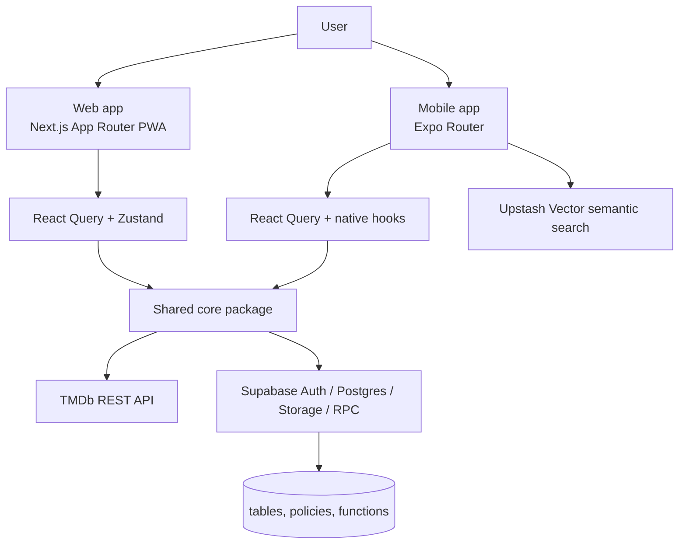

# Kino

[](https://www.typescriptlang.org/)
[](https://nextjs.org/)
[](https://expo.dev/)
[](https://supabase.com/)
[](https://tailwindcss.com/)
[](./apps/web/public/sw.js)
[](https://vercel.com/)
[](https://biomejs.dev/)

Kino is a cross-platform movie and series tracking app built as a pnpm monorepo. The web app is a Next.js PWA, and the mobile app is an Expo Router client. Both share the same product domain, Supabase backend, TMDb metadata layer, and localization files.

The goal of the project is not just to browse titles. Kino is designed to help users discover what to watch, record what they have already seen, rate individual movies and episodes, manage watchlists, and keep a diary of viewing history in a single coherent place.

## 📚 Table of Contents

- [🚀 Overview](#-overview)
- [🧰 Tech Stack](#-tech-stack)
- [🏗️ Architecture](#-architecture)
- [📦 Monorepo Strategy](#-monorepo-strategy)
- [💡 Design Decisions](#-design-decisions)
- [✨ Features](#-features)
- [🧪 Engineering Practices](#-engineering-practices)
- [⚙️ Getting Started](#-getting-started)
- [📂 Project Structure](#-project-structure)
- [🔭 Future Improvements](#-future-improvements)
- [🎤 Interview Talking Points](#-interview-talking-points)
- [📘 Lessons Learned](#-lessons-learned)

## 🚀 Overview

Kino is a personal viewing companion for people who want a focused way to:

-  discover new movies and series
-  save and rate titles they have watched
-  track episode progress for TV shows
-  organize watchlists, including shared lists
-  keep a chronological watch diary
-  edit and share public profiles
-  import viewing history from other services

The product is intentionally calm and task-focused. The web experience opens with a public landing page and lets anonymous visitors explore the catalog before signing in. Once authenticated, users get access to personal data features such as ratings, diary entries, profile edits, follows, and watchlist changes.

### Screenshots

The repository does not currently include committed screenshots. Suggested placeholders for a portfolio-ready README:

-  Web landing and discover page screenshot
-  Title detail page screenshot
-  Watchlist detail page screenshot
-  Diary page screenshot
-  Mobile home and search screenshots
-  Import flow screenshot

If you add images later, place them in a folder such as `docs/screenshots/` and link them here.

## 🧰 Tech Stack

### Frontend

-  `Next.js 15` with the App Router for the web app
-  `Expo 54` and `React Native 0.81` for the mobile app
-  `Expo Router` for native navigation
-  `React 19` across both clients

### Backend

-  `Supabase` for authentication, Postgres, storage, and RPC functions
-  `TMDb` as the source of canonical movie and TV metadata
-  `Upstash Vector` for the mobile semantic search experience

### Database

-  Postgres schema and migrations in `database/`
-  cached title metadata stored locally in Supabase tables
-  row-level security policies and SQL functions for authorization and aggregates

### Authentication

-  Supabase Auth
-  email and password login
-  magic link login
-  Google OAuth
-  web and native redirect handling with deep-link handoff

### State Management

-  `Zustand` for small client-side state on the web
-  `React Query` for server state and cache invalidation
-  mobile-specific hooks and query keys for native screens

### Styling / UI

-  `Tailwind CSS` on the web
-  `NativeWind` on mobile
-  shared web primitives in `packages/ui`
-  `Radix UI` components on the web
-  `react-native-reanimated`, `expo-blur`, and other Expo UI utilities on mobile

### Deployment

-  `Vercel` for the web app
-  `Expo` for the mobile app workflow
-  PWA manifest and service worker support on the web

### Tooling

-  `pnpm` workspaces
-  `Biome` for formatting and linting
-  `TypeScript` throughout the repo
-  `i18next` on mobile and a shared translation layer on web
-  `date-fns` for date formatting and calendar logic
-  `JSZip` for local import parsing

### Testing

-  No dedicated unit or integration test suite is committed yet
-  `pnpm typecheck` and `pnpm lint` are the primary verification commands today

### Build Tools

-  `Next.js` build pipeline for the web app
-  `Expo` prebuild and runtime tooling for mobile
-  `PostCSS` and `Tailwind` for web styling
-  `Metro` and React Native tooling for native builds

## 🏗️ Architecture

Kino is structured as a monorepo so the product can share domain logic while still shipping platform-specific UI where it matters.



### Layering

The codebase follows a practical layered split rather than a rigid formal framework:

-  `packages/core` holds shared domain types, transformations, import parsing, date helpers, and use cases.
-  `apps/web` and `apps/mobile` hold presentation and platform-specific behavior.
-  service wrappers isolate third-party APIs and persistence concerns.
-  route components and screens stay relatively thin and assemble reusable pieces.

This is close to a clean-architecture mindset, but it is intentionally lightweight. The goal is to keep business logic out of UI code without adding ceremony that the project does not need.

### Web Routing

The web app uses the App Router and splits public and authenticated surfaces cleanly:

-  `/` - marketing landing page
-  `/discover` - homepage style discovery feed
-  `/search` - catalog search and filtering
-  `/title/[id]` - movie or TV title detail page
-  `/person/[id]` - cast and crew profile page
-  `/diary` - watch diary
-  `/watchlists` and `/watchlists/[id]` - watchlists and watchlist detail
-  `/profile` and `/profile/[id]` - private and public profile views
-  `/settings` - account and profile settings
-  `/import` - history import flow
-  `/auth/login`, `/auth/register`, `/auth/callback` - authentication flow

`apps/web/components/app-shell.tsx` handles the shell split. Anonymous visitors see the landing page and public navigation. Signed-in users get the full app chrome. The auth callback route is intentionally rendered without the shell so redirects stay predictable.

### Mobile Routing

The mobile app uses Expo Router with:

-  a bottom tab layout for home, search, diary, watchlists, and profile
-  modal and stack screens for title details, profile settings, imports, and supporting flows
-  deep-link-based auth callbacks so OAuth and magic links can return to the app cleanly

### Data Flow

1. UI components trigger a React Query query or mutation.
2. The query or mutation calls a service wrapper instead of talking directly to the database from the component.
3. Supabase persists or reads data, while TMDb resolves title metadata.
4. Shared helper functions in `packages/core` normalize titles, dates, search candidates, and series progress.
5. Successful mutations invalidate the relevant query keys so the UI stays in sync.

### API Architecture

There is no separate custom REST backend in this repository.

-  Web and mobile both talk directly to Supabase for persistent data.
-  TMDb is queried directly for discovery, search, and title metadata.
-  The mobile app adds Upstash Vector for semantic search.
-  Aggregations that should stay close to the data layer are handled with SQL functions and RPCs.

### State Management

The project uses two different state models on purpose:

-  `React Query` handles server state, loading states, caching, retries, and invalidation.
-  `Zustand` handles small local concerns on the web, such as auth session state, language, and library filters.
-  Mobile leans on hooks and query state, which fits Expo Router and the screen-focused navigation model.

This split reflects KISS and separation-of-concerns thinking in the codebase. Server state is not mixed with transient UI state, and that keeps each concern easier to debug.

### Code Organization

The repo is feature-oriented rather than “one giant components folder” oriented:

-  route files assemble feature views
-  feature components own actual UI sections
-  shared service modules own external integrations
-  shared core modules own domain logic

That structure keeps the codebase DRY and easier to scale because additions typically land in a feature-specific location instead of becoming global utilities.

### Scalability Considerations

Several implementation choices are meant to keep the product maintainable as it grows:

-  TMDb metadata is cached locally in the `titles` table through `getOrCreateTitle`.
-  TV season metadata is stored alongside titles so completion logic does not require repeated external lookups.
-  Rating statistics are calculated with Supabase RPC functions instead of client-side scans.
-  Row-level security is used to enforce access rules at the database layer.
-  Shared import parsing keeps mobile and web behavior aligned.

This design favors stable internal identifiers and predictable data flow over ad hoc lookups, which makes future refactors less risky.

## 📦 Monorepo Strategy

Kino uses a monorepo because the two apps share meaningful product logic, but they do not share the same UI runtime.

### Why a Monorepo

-  One lockfile and one dependency graph keep versions aligned across web and mobile.
-  Shared types and use cases reduce the risk of feature drift.
-  Common translations live in one place, so localization stays consistent.
-  Shared domain logic can be improved once and consumed everywhere.
-  The developer experience is better because the same repository contains the product, backend schema, and shared packages.

### Shared Code Strategy

The repo deliberately shares the parts that benefit from consistency:

-  `packages/core` exports shared types, TMDb transforms, import parsers, date helpers, and data use cases.
-  `packages/ui` provides reusable web primitives like buttons, cards, dialogs, empty states, posters, and rating stars.
-  `locales/` stores the translation JSON that both apps consume.
-  `packages/config` keeps TypeScript configuration consistent.

### Why This Helps the Project

This structure improves maintainability because logic is centralized where it matters most:

-  data modeling changes are made once in shared types
-  rating and diary logic can be reused instead of duplicated
-  import parsing behaves the same way on both platforms
-  UI primitives stay visually consistent on the web
-  future applications could reuse the same shared core package without copying domain logic

The result is a project that can grow into additional surfaces without forcing every new feature to be reimplemented from scratch.

## 💡 Design Decisions

### Why Next.js for the web app

The web app needed a public landing page, authenticated app screens, metadata for sharing, and a PWA shell. Next.js App Router fits that mix well because it supports:

-  route-level composition
-  metadata generation
-  server-friendly deployment on Vercel
-  a clean split between public and authenticated surfaces

This is a pragmatic choice: the web app benefits from a framework that can handle both marketing pages and app screens without splitting them into separate projects.

### Why Supabase

Supabase gives the project a compact but realistic backend:

-  authentication without a custom auth service
-  Postgres for durable relational data
-  storage for avatars
-  SQL functions for rating aggregates
-  row-level security for access control

That combination lets the repository demonstrate real product engineering without introducing a full custom backend layer. The codebase also uses Supabase in a way that reflects good separation: persistence lives in service wrappers, while UI code stays focused on rendering and user interaction.

### Why a Shared Core Package Exists

`packages/core` keeps the most important logic away from presentation code:

-  TMDb-to-app data transformations
-  title normalization and search candidate selection
-  diary grouping and date formatting
-  episode and season progress calculations
-  CSV and ZIP import parsing

This supports DRY and single-responsibility thinking. The same domain rules are reused by web and mobile, which reduces duplicated logic and makes behavior easier to trust.

### Why React Query and Zustand Are Both Used

The split is deliberate:

-  React Query is the right fit for remote data, caching, retries, optimistic updates, and invalidation.
-  Zustand is a lightweight fit for local preferences and short-lived UI filters.

Using both avoids turning global state into a dumping ground. It also keeps the app modular: remote state, local preference state, and domain state are handled by different tools that fit their job.

### Why Imports Are Parsed Locally

The import flow accepts TV Time ZIP exports and Letterboxd CSV exports, but parsing happens on the client before anything is written to Supabase.

That decision improves privacy and user trust:

-  the export file stays under user control
-  the app can preview and edit mapped rows before saving
-  failed rows can be handled individually without aborting the entire import

This is a good example of KISS applied to UX: keep the import flow simple to reason about, and let the user validate the mapping before data is persisted.

### Why Profiles Are Bootstrapped From Auth Metadata

When a user signs in, the app ensures a matching profile row exists and fills in missing display data from Supabase Auth metadata where possible. That keeps the user experience smoother because profile pages and watchlist collaborators always have a user record to work with.

This also reduces edge-case handling in the UI because the profile system can assume a persistent row exists after authentication.

### Why the App Uses a Denormalized Title Cache

TMDb is the source of truth for media metadata, but Kino stores a local copy of the details it actually needs.

That gives the app:

-  stable internal IDs for ratings and diary entries
-  faster title pages after the first lookup
-  season metadata for progress tracking
-  less reliance on repeated external API calls

This is a very practical scalability trade-off. It adds schema complexity, but it makes the UI more responsive and keeps the experience stable when external metadata changes or when the app needs to render the same title repeatedly.

### Why the UI Is Restrained and Modular

The product intentionally avoids noisy, overdesigned streaming-app visuals. The web theme uses dark surfaces, a green accent color, strong hierarchy, and focused spacing so the app feels more like a utility for people who actually track what they watch.

Accessibility and responsiveness are treated as part of that design, not as an afterthought:

-  keyboard-visible focus states
-  semantic empty states
-  responsive layouts down to small mobile widths
-  localized copy
-  reduced-motion handling on the landing page

The UI is also composed from smaller building blocks instead of large monolithic screens. That composition-over-inheritance style makes it easier to reuse parts like cards, dialogs, and rating controls across features.

### Why Internationalization Is Structured This Way

Kino keeps translations in shared JSON files under `locales/`, and both apps read from those resources.

That structure is useful because:

-  copy is centralized
-  language support stays aligned across web and mobile
-  new screens can adopt localization without introducing a second system
-  the language preference can be persisted independently of the UI

The implementation is intentionally lightweight, which keeps translation overhead low while still supporting five languages.

## ✨ Features

### Authentication

-  email and password sign-in
-  magic link sign-in
-  Google OAuth
-  auth callback handling for web and native
-  automatic profile bootstrap after sign-in

### Discovery and Search

-  trending, popular, top-rated, now-playing, and upcoming feeds
-  movie and TV search
-  genre filtering
-  minimum rating filtering
-  localized TMDb queries
-  mobile semantic search with Upstash Vector

### Title Details

-  movie detail pages with poster, backdrop, cast, director, synopsis, and external links
-  TV detail pages with season progress, episode-level tracking, and completion logic
-  title-level rating and diary actions
-  watchlist actions from the title page
-  contextual actions for items that are currently in theaters in Brazil

### Diary

-  chronological viewing history
-  grouping by month
-  edit watched date, watch type, rating, and notes
-  delete individual diary entries

### Watchlists

-  create personal or shared watchlists
-  join watchlists with a share code
-  leave shared watchlists
-  edit name, description, and sharing state
-  remove items from a watchlist
-  show who added each title in shared lists

### Profiles

-  edit display name, username, bio, avatar, and banner
-  public profile pages
-  follow and unfollow users
-  follower and following lists
-  user search from the profile screen
-  watched movies and watched series shelves
-  average series rating view

### Import

-  TV Time ZIP import
-  Letterboxd CSV import
-  local file parsing before persistence
-  row-by-row review and editing
-  progress tracking, warnings, and failure handling

### Localization

-  English, Portuguese, French, Italian, and Norwegian
-  shared translation JSON files under `locales/`
-  persisted language preference on both web and mobile

### PWA

-  standalone web manifest
-  service worker registration in production
-  cached shell and basic offline fallback behavior

## 🧪 Engineering Practices

-  Shared domain types reduce drift between apps.
-  The import flow validates data before writing it.
-  Mutation handlers invalidate the exact query keys they affect.
-  Optimistic updates are used where they improve responsiveness, such as watchlist removal and leaving a list.
-  SQL functions handle aggregate rating logic close to the database.
-  Row-level security enforces access control at the data layer.
-  Reusable UI primitives keep the Next.js app consistent.
-  Form validation catches invalid usernames, passwords, and import payloads early.
-  Error states are explicit and user-facing rather than swallowed.
-  Performance-sensitive lookups use memoization and query caching where it is justified.
-  The title and diary experiences are built around durable IDs instead of relying on ad hoc client state.
-  Constructors such as `KinoDatabaseService(supabase)` and `TMDbService(apiKey)` show lightweight dependency injection in practice.
-  State updates in stores and import editors are written as focused updates rather than mutating shared objects in place.

These are the kinds of details interviewers often look for because they show judgment, not just feature delivery.

## ⚙️ Getting Started

### Prerequisites

-  `pnpm` 11.7.0
-  a current Node.js LTS release
-  Supabase project access
-  TMDb API key
-  Upstash Vector credentials if you want mobile semantic search

### Installation

```bash
pnpm install
```

### Environment Variables

The repo is set up to use a single root `.env` file. The web app maps `EXPO_PUBLIC_*` variables into `NEXT_PUBLIC_*` variables at startup, and the Expo app reads the same root values through `apps/mobile/app.config.js`.

Required variables:

```bash
EXPO_PUBLIC_SUPABASE_URL=
EXPO_PUBLIC_SUPABASE_ANON_KEY=
EXPO_PUBLIC_TMDB_API_KEY=
EXPO_PUBLIC_UPSTASH_VECTOR_REST_URL=
EXPO_PUBLIC_UPSTASH_VECTOR_REST_TOKEN=
EXPO_PUBLIC_WEB_URL=
EXPO_PUBLIC_AUTH_REDIRECT_URL=
EXPO_PUBLIC_APP_SCHEME=
```

Notes:

-  `EXPO_PUBLIC_WEB_URL` should point to your web origin.
-  `EXPO_PUBLIC_AUTH_REDIRECT_URL` can override the default `/auth/callback` redirect.
-  `EXPO_PUBLIC_APP_SCHEME` controls the native deep-link scheme.
-  The code defaults to `https://kino.vercel.app/auth/callback` and `kino://auth/callback` if you do not override them.

### Supabase Auth Setup

Allow the callback URL you use locally in Supabase Auth settings.

-  local web callback: `http://localhost:3000/auth/callback`
-  production callback: your deployed `/auth/callback` URL

### Development

Run the web app:

```bash
pnpm dev:web
```

Run the mobile app:

```bash
pnpm dev:mobile
```

### Production Build

Build the web app:

```bash
pnpm build:web
```

### Deployment

Web deployment is configured for Vercel through `apps/web/vercel.json`.

```bash
pnpm build:web
```

Then deploy the Next.js app with the environment variables above configured in Vercel.

For mobile development, use Expo tooling:

```bash
pnpm native:prebuild
pnpm android
pnpm ios
```

### Useful Scripts

```bash
pnpm dev
pnpm dev:web
pnpm dev:mobile
pnpm build
pnpm build:web
pnpm typecheck
pnpm lint
pnpm start
pnpm mobile:web
pnpm native:prebuild
```

## 📂 Project Structure

```text
apps/
  web/        Next.js PWA, landing page, auth, search, diary, watchlists, profiles, imports
  mobile/     Expo Router app with native tabs, modals, and platform-specific UI
packages/
  core/       Shared domain types, TMDb service, Supabase service, import parsers, use cases
  ui/         Shared web UI primitives used by the Next.js app
  config/     Shared TypeScript configuration
database/     Supabase schema, migrations, functions, and policies
locales/      Shared translation JSON files for en, pt, fr, it, and no
```

### Folder Notes

-  `apps/web/app` contains the route handlers and page-level composition.
-  `apps/web/components` contains page-level UI and reusable web components.
-  `apps/web/lib` contains browser-specific service wrappers and auth helpers.
-  `apps/web/stores` contains web-local Zustand stores.
-  `apps/mobile/app` contains the Expo Router screens and layouts.
-  `apps/mobile/components` contains native UI primitives and feature components.
-  `apps/mobile/hooks` contains data, auth, profile, and search hooks.
-  `apps/mobile/services` contains native Supabase, TMDb, search, and database integrations.
-  `packages/core/src` contains the shared business logic that keeps the apps aligned.

## 🔭 Future Improvements

-  Add a real test suite for critical flows such as auth, import parsing, and title progress calculations.
-  Extract more cross-platform UI so the web and mobile apps share even more presentation logic.
-  Add server-side or background search indexing for the web experience.
-  Expand import reconciliation with better fuzzy matching and duplicate detection.
-  Add offline-first syncing for native data entry flows.
-  Add richer analytics for viewing habits, such as streaks, seasonal breakdowns, and watchlist completion trends.
-  Add CI checks for linting, type checking, and schema validation.

## 🎤 Interview Talking Points

If you use this project in an interview, these are the topics most likely to produce good technical discussion:

### Interesting Challenges Solved

-  Building a shared domain layer so web and mobile stay aligned without sharing every UI component.
-  Modeling movie ratings, episode ratings, diary entries, and watchlists as related but distinct data flows.
-  Importing third-party history files locally, then mapping them safely into the user's account.
-  Keeping Supabase auth, deep links, and redirects consistent across web and native.
-  Calculating series completion and average season ratings from episode-level data.

### Trade-Offs Made

-  The app uses direct Supabase and TMDb access instead of a custom API backend, which keeps the stack smaller but pushes more orchestration into the client and shared service layer.
-  Title metadata is cached locally, which adds schema complexity but improves performance and stabilizes the user experience.
-  Web and mobile each have their own UI layer instead of trying to force a single cross-platform design system everywhere.
-  Search is TMDb-driven on web and hybrid on mobile, which reflects platform strengths rather than forcing one approach everywhere.

### Questions Interviewers May Ask

-  Why did you choose Supabase instead of building your own backend?
-  How are authorization rules enforced?
-  How does the auth callback work across web and mobile?
-  Why use React Query and Zustand together?
-  How does the import flow avoid creating duplicate history?
-  How do you determine whether a TV series is completed?
-  What data is cached locally, and why?

### Why This Project Shows More Than CRUD

-  It combines third-party APIs, relational persistence, authentication, file parsing, and cross-platform UI.
-  It includes domain modeling, not just basic form submission.
-  It has real edge cases: duplicate history, shared ownership, follow relationships, season completion, and import conflicts.
-  It demonstrates attention to UX, accessibility, internationalization, and deployment, which are all useful signals for a junior-to-mid-level portfolio project.

## 📘 Lessons Learned

-  Shared types and shared use cases reduce duplication more than shared UI alone.
-  Good data modeling matters more than fancy UI when the product revolves around user history and relationships.
-  Client-side import flows need staged validation and clear error handling.
-  Cache invalidation strategy is part of the product, not just an implementation detail.
-  Authentication is easier to reason about when redirect handling is centralized.
-  Localization is much cheaper to maintain when the app structure and copy strategy are designed for it from the start.
-  A restrained UI can still feel polished when the spacing, hierarchy, and interaction states are consistent.

---

Kino is intentionally built as a practical portfolio project: small enough to understand, but broad enough to show domain modeling, platform-aware UI, backend integration, and thoughtful product decisions.
