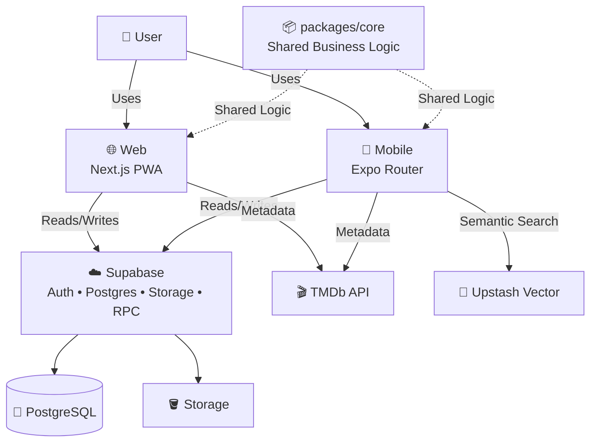
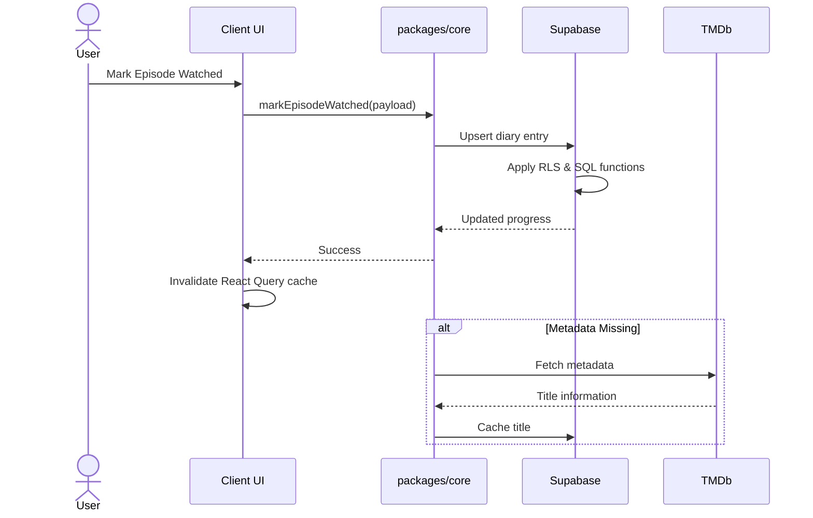

<div align="center">

# 🎬 Kino — Track Movies. Follow Series. Share Your Journey.

### *Your Quiet Cinema Companion*

<br />

<br />


<br />

<div>


</div>


<h3 align="center">Track movies and TV shows, keep a personal diary, discover new titles, build watchlists, and share your cinematic journey across web and mobile.</h3>
</div>

---

# 📖 Table of Contents

- [✨ About](#-about)
- [🚀 Features](#-features)
- [🏗️ Architecture](#️-architecture)
  - [🌐 System Overview](#-system-overview)
  - [🔄 Mark Episode Flow](#-mark-episode-flow)
- [🛠️ Tech Stack](#️-tech-stack)
- [🚀 Getting Started](#-getting-started)
  - [📋 Prerequisites](#-prerequisites)
  - [🔑 Environment Variables](#-environment-variables)
  - [📦 Installation](#-installation)
  - [🗄️ Supabase Setup](#️-supabase-setup)
- [🧩 Core Concepts](#-core-concepts)
- [📁 Project Structure](#-project-structure)
- [🗺️ Codebase Guide](#️-codebase-guide)
- [🚧 Future Improvements](#-future-improvements)
- [⚖️ Architectural Trade-offs](#️-architectural-trade-offs)

---

# ✨ About

**Kino** is a cross-platform movie and TV tracking application built as a **pnpm monorepo** with a shared domain layer between a **Next.js PWA** and an **Expo React Native** application.

Rather than trying to be another social network, Kino focuses on becoming a calm, personal companion for people who love cinema.

With Kino you can:

- 🎬 Track movies and TV shows
- ⭐ Rate everything you watch
- 📖 Maintain a chronological watch diary
- 📺 Track TV progress episode-by-episode
- 📚 Create public or private watchlists
- 👥 Follow other users
- 🌍 Discover new movies and series
- 📱 Continue watching seamlessly across devices

The project also serves as a portfolio demonstrating modern full-stack architecture using **Next.js, TypeScript, Supabase, Expo, React Query, and shared domain-driven packages.**

---

# 🚀 Features

## 🎬 Movie & TV Tracking

- Track movies and series
- Episode-level progress
- Rewatch support
- Automatic progress calculation

## ⭐ Ratings

- Star ratings
- Movie & series averages
- Season ratings
- Community ratings

## 📖 Personal Diary

- Chronological watch history
- Powerful filtering
- Sorting
- Rewatch entries
- Watch dates

## 📚 Watchlists

- Public watchlists
- Private watchlists
- Collaborative sharing
- Custom descriptions

## 👥 Social

- Public profiles
- Followers & following
- Friend activity
- Friend ratings
- Shareable profiles

## 🌍 Discover

- Trending titles
- Popular movies
- TV series
- Detailed metadata
- Cast & crew
- Recommendations

## 🔎 Search

- Instant search
- TMDb integration
- Semantic search (mobile)
- Cached metadata

## 📱 Cross Platform

- Next.js PWA
- Expo Native App
- Shared business logic
- Shared localization

## 🎨 Modern Experience

- Responsive design
- Dark mode
- Internationalization
- Open Graph images
- Smooth animations

---

# 🏗️ Architecture

Both clients share the same business rules located in **packages/core** while interacting directly with Supabase.

The mobile application additionally supports semantic search through Upstash Vector.

## 🌐 System Overview


```mermaid
flowchart TD

    User["👤 User"]

    Web["🌐 Web<br/>Next.js PWA"]
    Mobile["📱 Mobile<br/>Expo Router"]

    Core["📦 packages/core<br/>Shared Business Logic"]

    Supabase["☁️ Supabase<br/>Auth • Postgres • Storage • RPC"]

    Database[("🐘 PostgreSQL")]
    Storage["🪣 Storage"]

    TMDb["🎬 TMDb API"]
    Vector["🧠 Upstash Vector"]

    User -->|Uses| Web
    User -->|Uses| Mobile

    Web -->|Reads/Writes| Supabase
    Mobile -->|Reads/Writes| Supabase

    Web -->|Metadata| TMDb
    Mobile -->|Metadata| TMDb

    Mobile -->|Semantic Search| Vector

    Supabase --> Database
    Supabase --> Storage

    Core -. Shared Logic .-> Web
    Core -. Shared Logic .-> Mobile
```

---

## 🔄 Mark Episode Flow


```mermaid
sequenceDiagram

    actor User

    participant UI as Client UI
    participant Core as packages/core
    participant Supabase
    participant TMDb

    User->>UI: Mark Episode Watched
    UI->>Core: markEpisodeWatched(payload)

    Core->>Supabase: Upsert diary entry
    Supabase->>Supabase: Apply RLS & SQL functions

    Supabase-->>Core: Updated progress
    Core-->>UI: Success

    UI->>UI: Invalidate React Query cache

    alt Metadata Missing

        Core->>TMDb: Fetch metadata
        TMDb-->>Core: Title information
        Core->>Supabase: Cache title

    end
```

---

# 🛠️ Tech Stack

## 🌐 Frontend

- **Next.js** — App Router, SSR and PWA support
- **React 19** — Modern React architecture
- **TypeScript** — End-to-end type safety
- **Tailwind CSS v4** — Utility-first styling
- **shadcn/ui (Base UI)** — Accessible component system

## ☁️ Backend & Services

- **Supabase Auth**
- **Supabase PostgreSQL**
- **Supabase Storage**
- **Supabase SQL Functions (RPC)**

## 🎬 Media

- **TMDb API** — Movie and TV metadata

## 📱 Mobile

- **Expo**
- **React Native**
- **Expo Router**

## 🧠 Search

- **Upstash Vector** — Semantic search

## ⚙️ State Management

- **React Query**
- **Zustand**

## 🛠️ Developer Experience

- **pnpm Workspaces**
- **Biome**
- **Turbo**
- **GitHub Actions** *(planned)*

---

# 🚀 Getting Started

## 📋 Prerequisites

- Node.js (18+)
- pnpm
- Git
- Supabase project
- TMDb API Key

Optional:

- Upstash Vector

---

## 🔑 Environment Variables

```env
EXPO_PUBLIC_SUPABASE_URL=

EXPO_PUBLIC_SUPABASE_ANON_KEY=

EXPO_PUBLIC_TMDB_API_KEY=

EXPO_PUBLIC_WEB_URL=

EXPO_PUBLIC_AUTH_REDIRECT_URL=

EXPO_PUBLIC_APP_SCHEME=
```

Optional:

```env
EXPO_PUBLIC_UPSTASH_VECTOR_REST_URL=

EXPO_PUBLIC_UPSTASH_VECTOR_REST_TOKEN=
```

---

## 📦 Installation

Install dependencies

```bash
pnpm install
```

Run web

```bash
pnpm dev:web
```

Run mobile

```bash
pnpm dev:mobile
```

Run everything

```bash
pnpm dev
```

Typecheck

```bash
pnpm typecheck
```

Lint

```bash
pnpm lint
```

Production build

```bash
pnpm build:web
```

---

## 🗄️ Supabase Setup

Use either:

- Hosted Supabase
- Local Supabase CLI

Start locally

```bash
supabase start
```

Apply migrations

```bash
supabase db push
```

Configure Auth callback

```
http://localhost:3000/auth/callback
```

---

# 🧩 Core Concepts

## 📦 Monorepo

```
apps/
    web/
    mobile/

packages/
    core/
    ui/
    config/

database/
locales/
```

Business rules live inside **packages/core**, ensuring the web and mobile apps behave identically.

---

## 🔐 Authentication

Authentication is handled entirely by **Supabase Auth**.

Features include:

- Email/password
- Magic links
- Google OAuth
- Automatic profile creation
- Row-Level Security

---

## 🎬 TMDb Integration

TMDb acts as the source of truth.

Frequently accessed metadata is cached inside PostgreSQL to improve responsiveness and reduce external requests.

---

## 🗄️ Database Layer

The application intentionally keeps business logic close to the database.

Highlights:

- Row-Level Security
- SQL Functions (RPC)
- Aggregations
- Stable IDs
- Optimized queries

---

## ⚡ State Management

### React Query

- Fetching
- Caching
- Mutations
- Optimistic updates
- Background refetching

### Zustand

- Local UI state
- Preferences
- Filters
- Ephemeral data

---

## 📥 Import Flow

Imports are parsed locally before persistence.

This allows users to:

- Preview imported entries
- Fix mapping issues
- Remove unwanted rows
- Preserve privacy

---

## 📱 Mobile Features

Exclusive mobile features include:

- Semantic search
- Deep linking
- OAuth handoff
- Native navigation

---

# 📁 Project Structure

```text
kino/

├── apps/
│   ├── web/
│   └── mobile/
│
├── packages/
│   ├── core/
│   ├── ui/
│   └── config/
│
├── database/
│   ├── migrations/
│   ├── functions/
│   └── policies/
│
├── locales/
│
└── README.md
```

---

# 🗺️ Codebase Guide

| Location | Purpose |
|----------|---------|
| `packages/core` | Business logic |
| `apps/web` | Next.js PWA |
| `apps/mobile` | Expo application |
| `database` | SQL, migrations and RLS |
| `locales` | Shared translations |
| `packages/ui` | Shared components |

---

# 🚧 Future Improvements

- ✅ Comprehensive testing
- ✅ CI/CD pipelines
- ✅ Offline synchronization
- ✅ Background indexing
- ✅ Better recommendation engine
- ✅ Improved semantic search
- ✅ Background workers

---

# ⚖️ Architectural Trade-offs

Kino intentionally avoids a traditional backend.

Instead, it relies heavily on:

- Supabase
- PostgreSQL
- SQL Functions
- Row-Level Security

This architecture significantly reduces infrastructure complexity while remaining production-ready for small and medium-sized applications.

As the project grows, dedicated services (queues, workers, streaming pipelines, etc.) could be introduced incrementally without major architectural changes.

---

<div align="center">

Made with ❤️ by <a href="https://github.com/caiohportella">**Caio H. Portella**</a>

</div>
