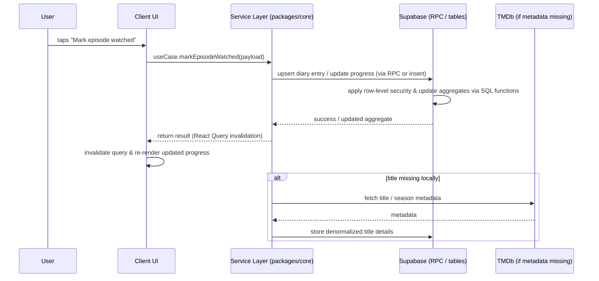

# 🎬 Kino — Your Quiet Cinema Companion

Kino is a cross-platform movie and TV tracking application (web PWA + native mobile) built as a pnpm monorepo. It helps users discover titles, track watch progress, keep a watch diary, create and share watchlists, and maintain a lightweight public profile — while demonstrating a practical, production-minded architecture using Next.js, TypeScript, and Supabase.

---

## Table of Contents

- [Project Overview](#project-overview)
- [Architecture & Data Flow](#architecture--data-flow)
  - [System Overview (Mermaid)](#system-overview-mermaid)
  - [User Action — Data Flow Example (Mermaid)](#user-action---data-flow-example-mermaid)
- [Tech Stack & Justifications](#tech-stack--justifications)
- [Getting Started](#getting-started)
  - [Prerequisites](#prerequisites)
  - [Environment variables](#environment-variables)
  - [Install & Run](#install--run)
  - [Local Supabase & Migrations](#local-supabase--migrations)
- [Core Concepts & Important Files](#core-concepts--important-files)
  - [Monorepo layout & shared packages](#monorepo-layout--shared-packages)
  - [Auth & Profiles](#auth--profiles)
  - [Title caching & TMDb integration](#title-caching--tmdb-integration)
  - [Database layer (Supabase/Postgres)](#database-layer-supabasepostgres)
  - [State management and data fetching](#state-management-and-data-fetching)
  - [Import flow & privacy](#import-flow--privacy)
  - [Mobile-specific: semantic search & deep links](#mobile-specific-semantic-search--deep-links)
- [Where to look in the codebase (quick map)](#where-to-look-in-the-codebase-quick-map)
- [Future improvements & trade-offs](#future-improvements--trade-offs)
- [License & credits](#license--credits)

---

## Project Overview

Kino is a focused, calm product for tracking movies and TV shows. It aims to be a simple personal companion — discover titles (via TMDb), mark watches and ratings, track series progress at the episode level, maintain chronological diary entries, and create personal or shared watchlists.

Design goals:
- Cross-platform parity: share domain and data logic across web and mobile.
- Minimal backend: rely on Supabase (Postgres, Auth, Storage) and SQL functions instead of a custom server.
- Privacy-minded import: parse user exports on the client and let users preview before persistence.

---

## Architecture & Data Flow

High level: web (Next.js) and mobile (Expo Router) clients share domain logic in `packages/core`. Both clients interact directly with Supabase for persistence and TMDb for metadata. Mobile augments search with Upstash Vector for semantic search.

### System overview (Mermaid)

```mermaid
graph TD
  U[User] -->|interacts| W[Web (Next.js PWA)]
  U -->|interacts| M[Mobile (Expo)]
  W -->|queries| SB[Supabase (Auth, Postgres, Storage, RPC)]
  M -->|queries| SB
  W -->|fetch metadata| TMDb[TMDb API]
  M -->|fetch metadata| TMDb
  M -->|semantic index & search| UV[Upstash Vector]
  SB -->|stores| DB[(Postgres: tables, policies, functions)]
  SB -->|stores files| Storage[(Supabase Storage)]
  packages_core[packages/core] -. shared logic .-> W
  packages_core -. shared logic .-> M
```

### User action — data flow example: "Mark episode watched"


```mermaid
sequenceDiagram
  participant U as User
  participant UI as Client UI
  participant Svc as Service Layer (packages/core)
  participant SB as Supabase (RPC / tables)
  participant TM as TMDb (if metadata missing)
  U->>UI: taps "Mark episode watched"
  UI->>Svc: useCase.markEpisodeWatched(payload)
  Svc->>SB: upsert diary entry / update progress (via RPC or insert)
  SB->>SB: apply row-level security & update aggregates via SQL functions
  SB-->>Svc: success / updated aggregate
  Svc-->>UI: return result (React Query invalidation)
  UI->>UI: invalidate query & re-render updated progress
  alt title missing locally
    Svc->>TM: fetch title / season metadata
    TM-->>Svc: metadata
    Svc->>SB: store denormalized title details
  end
```

---

## Tech Stack & Justifications

- Next.js (web) — Server rendering + App Router, PWA support, route-level composition, and great Vercel support. Chosen because the app needs marketing pages, dynamic metadata, and an app shell in the same project.
- TypeScript — Static typing across the monorepo reduces runtime errors, improves IDE DX, and makes shared types between web and mobile safe and explicit.
- Supabase (Auth, Postgres, Storage, RPCs) — Provides durable relational data, authentication, file storage, and server-side SQL functions so we can avoid a custom backend while still keeping strong security (RLS) and performance.
- Expo + React Native (mobile) — Fast iteration for native apps and shared JS/TS code with web when useful.
- React Query — Robust server-state manager: caching, retries, optimistic updates, and query invalidation.
- Zustand — Minimal local client state for small UI preferences and transient state.
- TMDb — Canonical source for media metadata; caching layer reduces external dependency pressure.
- Upstash Vector — Semantic search for mobile UI (optional): improves search quality via embeddings.
- Tailwind / NativeWind — Fast, utility-first styling consistent across web and mobile.
- pnpm monorepo — Deterministic installs, workspace sharing, and a single lockfile.

---

## Getting Started

This section covers the common local development path for most contributors.

### Prerequisites

- Node.js (LTS, e.g., 18+ or 20 depending on your environment)
- pnpm (11+ recommended)
- A Supabase project (or Supabase CLI for local dev)
- TMDb API key (for metadata)
- (Optional) Upstash Vector credentials for mobile semantic search
- Git and a GitHub account

### Environment variables

Create a root `.env` (not checked into source control). The apps read EXPO_PUBLIC_* prefixed variables to share config:

Required:
```
EXPO_PUBLIC_SUPABASE_URL=
EXPO_PUBLIC_SUPABASE_ANON_KEY=
EXPO_PUBLIC_TMDB_API_KEY=
EXPO_PUBLIC_WEB_URL=
EXPO_PUBLIC_AUTH_REDIRECT_URL=
EXPO_PUBLIC_APP_SCHEME=
```

Optional (for mobile semantic search):
```
EXPO_PUBLIC_UPSTASH_VECTOR_REST_URL=
EXPO_PUBLIC_UPSTASH_VECTOR_REST_TOKEN=
```

Notes:
- `EXPO_PUBLIC_WEB_URL` should be your web origin (e.g., `http://localhost:3000`).
- `EXPO_PUBLIC_AUTH_REDIRECT_URL` defaults to `/auth/callback`; adjust for mobile deep-linking if needed.
- `EXPO_PUBLIC_APP_SCHEME` is the app URI scheme (e.g., `kino://`) for magic link/OAuth returns.

### Install & Run

Install dependencies:
```bash
pnpm install
```

Run web dev server:
```bash
pnpm dev:web
# opens http://localhost:3000 by default
```

Run mobile dev (Expo):
```bash
pnpm dev:mobile
# opens Expo dev tools
```

Run both (concurrently, dev script in monorepo):
```bash
pnpm dev
```

Typecheck and lint:
```bash
pnpm typecheck
pnpm lint
```

Build production web:
```bash
pnpm build:web
```

### Local Supabase & Migrations

Options:
- Use a hosted Supabase project: create project, set env vars, apply migrations.
- Use Supabase CLI locally:
  1. Install supabase CLI and start a local instance: `supabase start`
  2. Apply migrations located in `database/` via `supabase db push` or with psql:
     ```bash
     psql <db_connection_string> -f database/migrations/xxxx.sql
     ```
  3. Configure Supabase Auth callback to include your local redirect: `http://localhost:3000/auth/callback`.

Database schema: see `database/` for tables, RLS policies, and SQL functions (aggregates and permission logic). Run migrations in the project to ensure Postgres matches the app expectations.

---

## Core Concepts

Below are the most important, and sometimes subtle, parts of the codebase you should understand.

### Monorepo layout & shared packages
- apps/
  - web/ — Next.js App Router PWA code, route components, web-specific UI.
  - mobile/ — Expo Router mobile app screens, hooks, native UI.
- packages/
  - core/ — Domain types, TMDb transforms, import parsers, use-cases and services.
  - ui/ — Shared UI primitives (used primarily by web).
  - config/ — shared TypeScript and build config.
- database/ — Postgres schema, migrations, SQL functions and RLS policies.
- locales/ — JSON translations consumed by both clients.

Why it matters: the `packages/core` houses the business rules (title normalization, episode progress, import parsing) so both clients behave identically.

Key files:
- packages/core/src — domain types, parsing utilities
- apps/web/lib/supabase.ts — web Supabase client wrapper
- apps/mobile/services/supabase.ts — mobile Supabase wrapper

### Auth & Profiles
- Supabase Auth is the central auth provider (email/password, magic link, Google).
- Profile records are bootstrapped on-sign-in: an auth event creates/ensures a profile row.
- RLS policies in Postgres restrict access; client-side code uses lightweight dependency injection (e.g., `KinoDatabaseService(supabase)`) to abstract queries.

Why this approach: offloading auth and authorization to Supabase and Postgres RLS reduces application server scope and centralizes access control in the data layer.

### Title caching & TMDb integration
- TMDb is used as an authoritative metadata source.
- Kino stores a denormalized local copy of only the fields it needs (poster paths, season structures, stable internal IDs) in the `titles` table.
- `getOrCreateTitle` logic ensures stable IDs for diary and rating records and avoids fetching the same TMDb data repeatedly.

Trade-off: denormalization adds schema complexity but improves UI responsiveness and keeps entities stable.

### Database layer (Supabase/Postgres)
- Use SQL functions (RPCs) for aggregates (e.g., average ratings) to minimize client-side scanning.
- Use Row-Level Security (RLS) for correctness and to trust server-side enforcement.
- Keep heavy aggregations close to data, but expose targeted RPCs for common queries.

Examiner-friendly note: You can point to specific SQL functions and RLS policies in `database/` to discuss design and security.

### State management and data fetching
- React Query -> server state: caching, retries, background refetching, optimistic updates.
- Zustand -> local transient state: UI filters, language preference, small ephemeral stores.
- Clear separation avoids mixing concerns and keeps queries and UI state predictable.

Example: marking an episode watched uses a React Query mutation that triggers a Supabase upsert and then invalidates the relevant series progress query.

### Import flow & privacy
- Imports (e.g., Letterboxd CSV) are parsed client-side before persisting.
- The UI previews rows and allows edits so users can control what is written to Supabase.
- Failure handling: keep import row-level, allow partial successes, surface mapping warnings.

Why mention in interviews: highlights privacy-first decisions and UX engineering to handle imperfect data.

### Mobile-specific: semantic search & deep links
- Mobile optionally uses Upstash Vector to provide semantic search (embeddings + vector DB).
- Deep-linking & auth: Expo Router + deep links support OAuth and magic link handoff between browser and app.

---

## Where to look in the codebase (quick map)

- packages/core/src — domain types, transforms, import parsers, business logic
- apps/web/ — Next.js app router, route-level components, app shell at `apps/web/components/app-shell.tsx`
- apps/mobile/ — Expo Router screens, auth hooks, deep-link handling
- apps/web/lib/supabase.ts and apps/mobile/services/supabase.ts — supabase wrappers
- database/ — migrations/, functions/, policies/
- locales/ — translation artifacts used by both clients

---

## Future improvements & trade-offs

- Add a comprehensive test suite (unit + integration) for critical flows (auth, import, progress calculation).
- Add CI checks for schema migrations, lint, typecheck, and tests.
- Improve server-side or background indexing for web search.
- Consider an incremental sync or offline-first model for native entries (work queue + reconciliation).
- Expand semantic search and background workers for indexing if data volume grows.

Trade-offs:
- Current architecture favors developer velocity and demo-ability over absolute scalability (no custom backend, no streaming workers). This is a pragmatic choice for a portfolio project but would change as user load grows.

---

## License & credits

Kino is MIT licensed. Built with ❤️ by Caio H. Portella — https://github.com/caiohportella.
